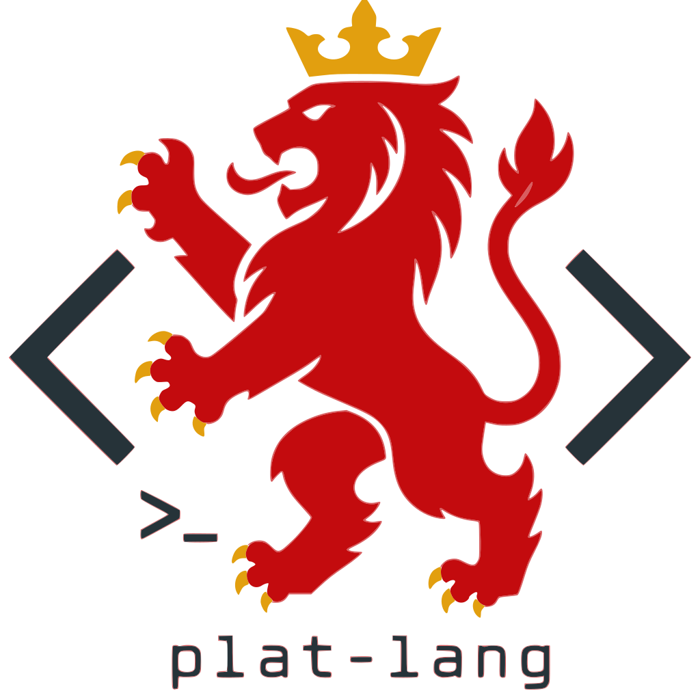

<section class="plat-intro">
  
  <h1>plat-lang</h1>
  <p>
    Ein experimentele oetveurdertaol wo de code klein blief, de regels
    geregeld blieve, en de sleutelwäörd oet Limburg komme.
  </p>
  <div class="plat-actions">
    <a class="plat-button" href="getting-started.html">Aan de geng</a>
    <a class="plat-button secondary" href="https://github.com/ifilot/plat-lang">GitHub</a>
  </div>
</section>

## Ein Klein Schriefsel

```platlang
funksie viefkes(getal):
    es getal < 2:
        trok getal
    angesj:
        trok viefkes(getal - 1) + viefkes(getal - 2)
    enj
enj

aafdrokke(viefkes(10))
```

<div class="plat-grid">
  <div class="plat-card">
    <h3>Limburgse sjtem</h3>
    <p>Sleutelwäörd wie <code>funksie</code>, <code>loat</code>, en <code>trok</code> geve de taol eine eige klank.</p>
  </div>
  <div class="plat-card">
    <h3>Kleine runtime</h3>
    <p>Nommers, tekste, booleans, <code>niks</code>, en veranderbare <code>mepke</code>-tabellen make de kern.</p>
  </div>
  <div class="plat-card">
    <h3>Geinterpreteerd</h3>
    <p>Veur <code>.plat</code>-schriefsels rechstreeks oet mit <code>platlang</code>; de oetveurder leest, controleert, en voert 't programma veur dich oet.</p>
  </div>
</div>
